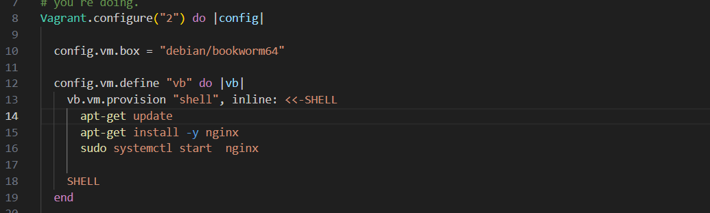
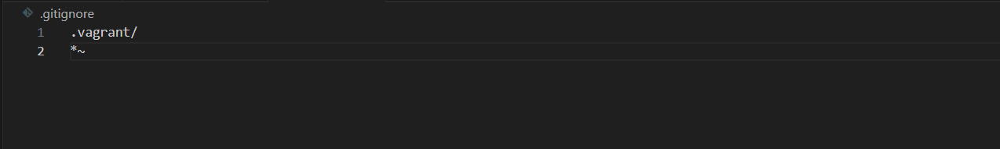

# servidorWebNginx

1.Añadimos vagrant con vagrant init y hacemos la configuración inicial de la máquina con la instalación e inicio de nginx

    añadimos esta configuración en el archivo .gitignore para que toda la configuración de vagrant no  se suba a github

