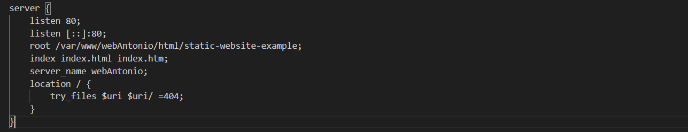

# servidorWebNginx

## Configuración para configurar el servidor web con Nginx y mostrar la pagina de prueba del repositorio que hemos clonado

### Añadimos vagrant con vagrant init y hacemos la configuración inicial de la máquina con la instalación e inicio de nginx

### añadimos esta configuración en el archivo .gitignore para que toda la configuración de vagrant no  se suba a github

###  Añadimos los comandos necesarios para crear la carpeta donde se va a situar el sitio web, accedemos a él, clonamos el sitio de prueba, le damos los permisos necesarios y le cambiamos el propietario a www-data

### Configuramos el servidor web nginx

1. Primero añadimos una linea en el archivo vagrantfile para eliminar el directorio static-website-example para evitar conflictos al ejecutar vagrant provision

2. Creamos un archivo llamado webAntonio en vagrant con la configuración del servidor nginx

3. Copiamos el archivo webAntonio de vagrant al directorio /etc/nginx/sites-available/webAntonio, creamos un enlace simbólico en sites-enabled, comprobamos y reiniciamos el servicio de nginx

4. Archivo vagrantfile completo

5. Comprobamos que funciona correctamente poniendo en el navegador la url http://webAntonio
añadimos al archivo etc/hosts la direccion ip y el nombre del servidor

Página web de ejemplo

## Configuración Para configurar el servidor web con Nginx y mostrar nuestra pagina
